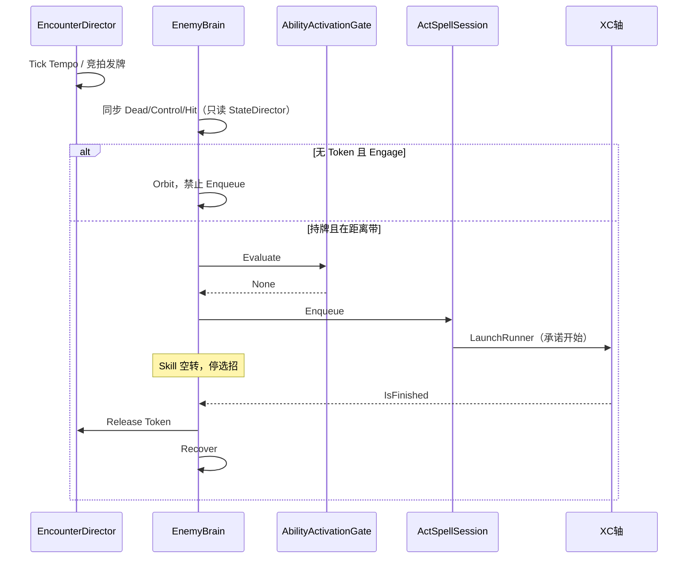

# ACT 敌人 AI：导演 + HFSM + 效用选招 + XC 轴

> **现状**：A～F、Telegraph 占位、12000 号段、突进/红闪、车轮战/徘徊、杂兵/精英档、连段、Special、假前摇均已落地。杂兵不再挂 12004；12002/12004 走轴上预警；Alert 有占位十字。屏外公平（G）未做。后续只看 **§十二**。
> 手感对照以**绝区零**为主：进攻权、黄/红预警、闪避空窗、失衡窗。招式表与精英相位可参考，**弹招 / 格挡不学鸣潮弹刀**（无收缩金圈）。调研摘录见文末附录。
> 关联：`CombatEntity`、`CombatStateDirector`、`ActSpellComponent` / `ActSpellSession`、`AbilityActivationGate`、`CombatTimeClock`。
> 本文只补**决策层**。失衡条见 `Docs/ActBuffLearningBacklog.md`（禁止做成 TimeBuff）。

---

## 一、目的

技能轴、门控、受击、冻结已通。缺的是谁打、何时打、打哪招。

场上验收：

1. 同屏 4～8 杂兵时，同时出真伤轴不超过 1～2 只。其余绕圈、压迫、假前摇，不一起挥。
2. **开招即承诺**：选中的技能把 XC 轴播完；只有受击（打断≥抗打断）/ 硬控 / 死亡才能打断。
3. 前摇可读；落空、完美闪、招架成功后全场有 Recover / Relax，玩家能反击。
4. 招式有身份（近/中/远、可闪 / 可招架 / 不可招架），由招表 + 轴事件表达，不写 `if (技能名)`。黄闪可招架、红闪必须闪——学绝区零，不做鸣潮金圈弹刀。
5. 精英 / Boss 同一套大脑，只换预算与相位。

玩家侧已有、AI **只消费不重复做**：Hurtbox、伤害乘区、抗打断、HitStop、时间断裂、死亡溶解。受击交 Token，闪避进 Relax。

---

## 二、硬约定

1. AI 不进 `CombatEntity` 内核，不进 `DamageAction` / Resolver。决策在 ACT 层；表现走 `CombatPresentationDirector`。
2. **唯一出招口**：`ActSpellComponent.Enqueue` → Gate → Session → XC。禁止直接 `Animator.Play` 或绕过 Gate。
3. Enqueue 后 Brain 停选招，直到 `ActiveExecution==null`（轴 `IsFinished` 后 Session 清句柄）。这是承诺。
4. **四根钟不变。** 导演用 `GameTimeManager.WorldDelta`。Brain / 选招 / 敌人 CD 用 `CombatTimeClock.GetDelta(unit)`。实体钟=0 的怪不思考、不走、轴停；导演仍可转牌。禁止第五根钟，禁止 `Time.timeScale`。
5. 失衡是计量条，满了才进 Stagger / Punish；不要做成 `IdStatuses` 里的 TimeBuff。
6. 热路径零 GC：固定数组、无 LINQ、无每帧 `GetComponent` / `new List`。导演容量 16。
7. 流程问 Tag 和门控：`IsCanSpellSkill`、`MoveWeight`、`Buff.MoveForbid`。不要 `if (眩晕)`。
8. `EGamePlay.Combat` 只认 `ICombatUnit`，不引用 `EnemyBrain`。
9. **难度只改预算、冷却、拍卖周期**（`EncounterDirectorProfile`），不改伤害表。

---

## 三、分层与时序

```
CombatContext.Update(WorldDelta)
  ├─ CombatEncounterDirector.Tick(WorldDelta)     // 发/收 Token、节奏、站位
  ├─ SpellSession Tick / HitPipeline.Flush
  └─ CombatEntity.Update(GetDelta(unit))
        ├─ CombatStateDirector.Tick                 // 唯一写 CurState
        ├─ EnemyBrainComponent                      // 读导演，写移动 / Enqueue
        │     HFSM  →  SkillSelector  →  Enqueue
        └─ ActSpellComponent                        // Gate、开 XC 轴
```

| 层 | 问什么 | 写什么 | 不写什么 |
|---|---|---|---|
| 导演 | 这场谁可以打、该紧还是该松 | Token、站位槽、Tempo | SkillId、动画 |
| HFSM | 这只怪处于哪段战术生活 | 战术态、移动模式 | `CurState`、伤害 |
| 效用选招 | 合法招里出哪一招 | 一次 `Enqueue` | 轴播放、每帧改招 |
| XC 轴 | 这一招怎么打完 | 盒、Tag、位移、表现消息 | 再决策 |

```text
CombatContext.Update(WorldDelta)
  1 Director.Tick     回收租约 / Tempo / 竞拍发牌 / 偶尔重分配槽
  2 SpellSession.Update、HitPipeline.Flush
  3 每个 CombatEntity.Update(GetDelta)
       StateDirector → 【玩家】TickSkillInput → EnemyBrain → ActSpell
```

Brain 若加在 ActSpell 之后，Enqueue 晚一帧消费——可接受。冻结：`GetDelta=0` → Brain/轴/电机停；导演仍 Tick，可把牌转给未冻的怪。



---

## 四、导演 `CombatEncounterDirector`

战局单例，挂在 `CombatContext` 旁（`EGamePlayInit` 在 Context.Update **之前**用 `WorldDelta` Tick）。不是每个敌人一份。

只收 `AgentTag.enemy` 且未死亡。假玩家默认不进导演。`ActPlayer.Init` 末尾 Register；销毁 / 回池 Unregister。

调参全部在 `EncounterDirectorProfile`（`Resources/Config/Ai/DefaultEncounter.asset`）。缺资产回退代码默认。`ResetCache` 在导演 Awake，编辑器改完重进 Play 生效。

### 4.1 Token

```text
TokenKind: Melee | Ranged | Special
```

| 种类 | 预算 | 谁用 |
|---|---|---|
| Melee | 1 | 近战普攻 / 短突进 |
| Ranged | 0（枚举在，导演不发） | 远程招 |
| Special | 场上有精英则 1 | 红闪重击、点名、将来的黄闪可招架招 |

规则：

1. 没拿到对应 Kind，不准 Enqueue **真伤轴**。假前摇不算真伤轴。
2. 同一敌人默认 Melee 与 Special 互斥（Boss 将来 `AllowMeleePlusSpecial`，未做）。
3. **租约** `GrantTimeout`（1.4s）：未 Enqueue 则收回并冷却。
4. **释放**：轴结束、受击、硬控、死亡、脱战、Break、Launch 失败。之后 `PerEnemyCooldown`（0.8s）不再授予。
5. Relax / Punish 收回**未承诺**的牌（`RecallUncommittedSlot`，Melee+Special）；已 Enqueue / 占轴的不打断。

**发牌（竞拍，不是先到先得）**：

- Brain 每帧 `TryAcquireToken` 只登记意愿（TTL `WantTtl` 0.3s）。导演下一 Tick 在意愿者中取最高分发放。
- 两次发放最小间隔 `GrantInterval` 0.25s（进攻频率旋钮）。
- 发放后 `StealGrace` 0.35s 内不可抢；之后按分数滞回（`StealHysteresis` 1.05）抢「持有但尚未 Enqueue」的牌。已占轴不可抢。Special 不抢夺。
- 精英在 Special 招带内改申请 Special（`ChooseTokenKind`）。

打分：

```text
score = Offscreen(画幅内 1 / 外 0.15)
      * 距离(近高，夹 0.2～1)
      * (0.25 + 0.75·Desire)
      * 槽位(前 1 / 翼 0.88 / 后 0.32 / 溢出 0.22)
      * 不在 Recover / 个人 CD / 不能施法则 0
```

**Desire（车轮战）**：世界钟增长（基础 0.45/s，内圈槽 +0.35/s，上限 1）。出手或占轴被打断清零。新登记按 Id 哈希给 0.3～0.8 初始散布。刚打完的人短期难再中标，久未出手的轮到。

**内外圈轮换**：槽位重分配时，外圈欲望最高者与内圈欲望最低者（都不持牌）差值 > `SwapDesireMargin` 0.4 则换槽，换入者欲望减半防抖。

屏外：目前只降权，**仍可拿牌出手**。硬禁 / `OffscreenDelay` / 屏外指示器见 §十二（G，暂缓）。

### 4.2 Tempo

战局级，不是每只怪一份。走 `WorldDelta`（玩家钟断裂时空窗一起慢）。

| Tempo | 发牌 | 进入 | 状态 |
|---|---|---|---|
| Build | 按预算 | 接敌、空窗结束 | 已落地 |
| Relax | 全部 Kind 视为 0 | 见下 | 已落地 |
| Peak | Melee 临时 +1 | 连续受击 / 久不闪 | 枚举在，无进入条件 |
| Punish | 预算 0 + Stagger 不抢牌 | 计量条刚破 | 接口在，无进入路径 |

Relax（多次事件取更晚结束时间，不缩短）：

| 事件 | 时长 | 来源 |
|---|---|---|
| 完美闪（i-frame 闪过攻击） | 0.45s | `CombatHitResolver` 标 Dodge → `NotifyPlayerDodge(true)` |
| 普通翻滚 | 0.15s | 本地玩家翻滚 `PostSpell` → `NotifyPlayerDodge(false)` |
| 攻击完全落空 | 0.25s | 轴 `IsFinished` 且盒从未碰到玩家 → `NotifyAttackWhiff`。Break 不当挥空；无盒轴（假前摇）跳过 |
| 招架成功（黄闪） | 待定，量级对齐完美闪 | K 未做；成功招架应把回合让出，与绝区零「被挡进观察」一致 |
| HP 短窗口大掉 | **不要**进 Relax | 那是 Peak，避免「越残越轻松」 |

Punish：计量条破 → `BeginPunish`，**应当 BreakSkill 进 Stagger**。未做。

### 4.3 站位

玩家周围 4 个近战槽（前 / 左 90° / 右 90° / 后）+ 溢出环。0.25s 重分配；已占槽且仍存活则保留。Melee 持牌者优先前槽。第 5 人起走更大半径溢出环（Id 哈希角）。

Brain 的 Approach / Orbit 走向 `TryGetOrbitAnchor`，不直扑脚底。Windup 仍按招式带贴玩家。

**徘徊**：锚点绕基线角做无状态正弦慢摆（槽 ±0.30 rad，溢出 ±0.40 rad，相位错开）。走近锚点时缩短移动轴。Boss **不进槽**（未做）；杂兵绕玩家。

槽分配半径用场上活人 `KeepDistance` 均值（回退 `EncounterSlotAssigner.DefaultKeepDistance = 3.6`）；个体 Orbit 仍走自己 Profile（精英 3.2）。

### 4.4 焦点

本地玩家 `PlayerManager.LocalPlayer.Combat`。死亡则场上第一个存活玩家。黑板目标只从导演读。威胁表 / 多焦点未做。

### 4.5 API

```csharp
Register / Unregister
Tempo / FocusTarget
TryAcquireToken / ReleaseToken / HasToken
TryGetOrbitAnchor / IsOnScreen
NotifyPlayerDodge / NotifyAttackWhiff
NotifyBreakMeterOpened   // 草图，无人调用
```

`IsOnScreen`：`Camera.main` 视口 5%～95%。G 阶段应对齐相机 Stage2 真机画幅。

---

## 五、战术 HFSM 与移动

`EnemyBrainComponent`：每敌人一份，`IsNeedUpdate=true`。只读战斗态；只写移动提供者、朝向、Enqueue、向导演借还 Token。

`CombatStateDirector` 仍是 **唯一写 `CurState`**。Brain 每帧最先同步：

```text
Dead     ← owner.IsDead
Control  ← StateDirector.IsControl（含冻结）
Hit      ← CurState==Hit
Skill    ← ActiveExecution!=null
其余     ← 战术逻辑
```

硬控结束：死亡除外，敌人也重新 Enable 电机；能否走仍由 `MoveWeight` 决定。

| 状态 | 做什么 | 状态 |
|---|---|---|
| Idle | 站桩 | 已落地 |
| Alert | 转向，世界钟延迟（首次 0.35s / 再接敌 0.1s） | 已落地；占位暖橙十字，正式感叹号/音效仍缺 |
| Approach | 向锚点或招式最小距离走 | 已落地 |
| Orbit | 环绕锚点，面朝目标 | 已落地；精英可假前摇 |
| Windup | 进带、面向、选招 | 已落地 |
| Skill | **空转** | 已落地；连段在此窗口追加 |
| Recover | 还牌，实体钟倒数；过近 BackOff | 已落地；起点 = 轴 `IsFinished` |
| Stagger / Phase / Return | 破衡、Boss 换阶段、脱战回出生点 | **未做**（枚举里也还没有） |
| Dead | 停电机、Unregister | 已落地 |

Launch 失败：立刻还牌 `FailedLaunch`，回 Orbit。`BreakSkill`：不走完整 Recover，走 Hit/Control 同步，仍还牌。

连段占用 `_castPending`，避免两段之间掉进 Recover；0.5s 挂起超时兜底。

### 5.1 移动

不新写 CharacterController。非主控绑 AI 三件套（`CombatLocomotionInstaller`）：

| 注入 | 作用 |
|---|---|
| `AiMoveInputProvider` | `MoveAxis`；Orbit 走/慢跑，Approach 慢跑 |
| `AiTargetFacingProvider` | 始终看黑板目标 |
| `AiAimBasisCameraProvider` | `PlanarForward` = 展平(目标-自己)。**禁止跟 `Camera.main` 拆轴** |

模式：Stop / Close / OrbitCW·CCW（Id 奇偶固定）/ BackOff。径向：距 > KeepDistance+死区向前，< KeepDistance-死区向后。死区 ±0.35m。

`EnemyHfsm.TryResolveForced`：Brain 每帧最先同步 Dead / Control / Hit / Skill（占轴）。Skill 强制态仍跑 FollowUp。

---

## 六、效用选招

只在 Windup、持所需 Token、且 `IsCanSpellSkill` 时跑。100ms 世界钟节流。

数据在 `EnemyMoveSet`（ScriptableObject），**距离带不进伤害段表**。生成时 `AttachAbility(SkillId)`，与玩家同源。

| 字段 | 含义 |
|---|---|
| `SkillId` / `Sort` | 技能表 + Gate |
| `TokenKind` / `RequiresToken` | 假前摇 `RequiresToken=false` |
| `MinRange` / `MaxRange` / `PreferredRange` | 带外分数=0 |
| `BaseWeight` / `RepeatPenalty` | 基础欲望；刚用过则乘 0～1 |
| `RecoverSeconds` | 覆盖 Profile 后摇 |
| `TelegraphKind` / `TelegraphSeconds` | None / Dodge / Parry（黄=可招架）/ Jump / Unblockable（红=必须闪）；`<0` 轴上 AiTelegraph（Brain 不播）；0 用 0.5s |
| `PhaseMask` | 当前相位 bit；`PhaseIndex` 仍写死 0 |
| `IsFeint` | Selector **跳过**，不进效用 |
| `FollowUpSkillId` | 同 Token 连一段 |

打分（乘算，任一 0 淘汰）：

```text
score = BaseWeight * Distance * Token * Cd * Gate * Phase * Repeat * Screen(内 1 / 外 0.2) * Tempo
```

`score < 0.05` 无招，继续贴近，不降智乱放。平局用 `entity.Id` 抖 0.01。Gate 选招时评、Enqueue 前再评；失败不等预输入，等下一拍。

### 6.1 连段

`IsMainFinish` 且仍持牌且 FollowUp Gate 通过 → **一次**追加 Enqueue，不重新向导演要牌。第二击也亮 Telegraph。杂兵 `12001→12003`；精英 Special 默认不许 FollowUp。Relax 不拦连段（已承诺攻击的一部分）。

### 6.2 距离带（杂兵）

| 招 | 带 | 用途 |
|---|---|---|
| 12001 近劈 | 0.8～2.8m | 贴脸；可接 12003 |
| 12002 突进 | 2.5～5.5m | 保距附近 |
| 12003 第二刀 | 0.8～2.4m | 连段 |
| 12004 红闪 | 1.0～3.2m | **只走精英 Special**（杂兵表已去掉） |
| 12005 虚招 | — | 假前摇，无盒 |

拿到 Melee 后再进到约 1.5～2.2m 开近劈。

---

## 七、XC 轴、Telegraph、招式身份

时间轴继续负责盒、段号、位移、`SetCanMove`、霸体 Tag、表现包。AI 只旁观，用消息约定可读性。

| msgName | 何时 | 谁消费 |
|---|---|---|
| `AiTelegraph` | 前摇开始 | 表现。`strMsg`=TelegraphKind 名，`floatMsg`=时长秒（0=默认） |
| `AiActive` | 判定开始 | 可选，未用 |
| `AiSafe` | 判定结束 | 可选；Recover 仍以 `IsFinished` 为准 |

招式应对（学绝区零三级提示，**不要**在 DamageAction 里特判）：

| 预警 | `TelegraphKind` | 玩家该做什么 |
|---|---|---|
| 无 / 暖白 | `None` / `Dodge` | 闪避或硬抗 |
| **黄闪** | `Parry` | **可招架**（支援招架 / 格挡键）。成功 → 打断或重硬直 + Relax，可贡献失衡 |
| **红闪** | `Unblockable` | **不可招架，必须闪** |

K 未做：黄闪招 + 玩家招架技能。判定用轴上 `Ai.Parryable` Tag（GrantTag 推入判定窗），招架命中该盒才算成功。不做鸣潮收缩金圈、不做帧精确「重合弹刀」。

断招（已落地，学绝区零比大小，不抄 1～8 表）：段表 `InterruptLevel` ≥ 目标抗打断才 `BreakSkill` 进 Hit。站立抗打断杂兵 1 / 精英 3 / 玩家 1；轴上 `Buff.UnStopped` 只 **+3**，不是免疫。`HitReaction` 只管闪白/顿帧。硬控（`MoveForbid` / 冻结）仍直接进 Control，不比抗打断。初值：Light=0，Heavy 回退=3，**玩家 11003=5**（能破杂兵霸体窗 1+3=4），12004=5。精英出招窗抗打断 6，11003 仍打不破。

技能中位移：沿用轴上 RootMotion / 曲线。Brain 在 Skill 输出 Stop，避免和位移抢。`MotionDirector` 水平通道**互斥**：`UseRootMotion=1` 时 SkillCurve 会被拒绝。带曲线的招必须 `UseRootMotion: 0`。

落空：Session 结束时对**焦点侧**（本地玩家或 PlayerA/B）确认命中为 0 → `NotifyAttackWhiff`。计数在 Session / HitResolver，不进 DamageAction。无盒轴（`ActSkillRunner.HasHitboxEvents=false`，装配时写入）跳过。

时间断裂：敌人轴与 Relax 都走世界钟；玩家完美闪开断裂时怪慢、空窗也慢。

### 7.1 Telegraph（占位已落地）

门面 `CombatTelegraph`：头顶程序化四角星（8 槽池、billboard、unscaled、不走画质门控）。配色对齐绝区零：Parry 黄（可招架）、Unblockable 红（必须闪）、Jump 青、Dodge 暖白。黄闪不是鸣潮金圈。

两条路径：

1. 轴上 `AiTelegraph`（源跟技能，Break/Finish 自动淡出）——正式敌人轴应用这条。
2. Brain 兜底：借用轴没有消息时，Enqueue 成功按 `TelegraphSeconds` 播。死亡经 StopByEntity 淡出。

音频：`CombatTelegraph.Shown(kind, worldPos)`。无人订阅时零开销。

当前预警：

- **12002 / 12004**：轴上 `AiTelegraph`（时长按抬手帧 / Speed：0.29s / 0.82s），招表 `TelegraphSeconds=-1` 避免 Brain 再闪一次。
- **12001 / 12003**：仍 Brain 兜底 0.45s。嫌噪声可改 `TelegraphKind.None` 或补轴消息。

### 7.2 招式身份（占位轴）

- **12002 突进**：MoveEvent 前冲 2～16 帧、3.2m、OutCubic；方向=开轴朝向。必须 `UseRootMotion: 0`。轴上 `AiTelegraph` Dodge。技能编辑器重导出会覆盖位移轨与消息轨。
- **12004 红闪**：轴上 Unblockable；挥击段 6～40 帧 `Buff.UnStopped`（抗打断 +3）；`InterruptLevel` 5；单段 Heavy、高倍率；低权重 + 复读惩罚。精英 `TokenKind=Special`。
- **12005 假前摇**：12001 去盒。精英 Orbit、别人真打时按 `FeintInterval` 3s 播（首次 Id 哈希散布）。无闪光、不进选招、不触发落空 Relax。

动画仍借用玩家剪辑，动作与位移不完全对位。

---

## 八、档位与技能号段

同一套代码，换 Profile / MoveSet / 导演预算。

| 档 | 挂接 | 差异 | 状态 |
|---|---|---|---|
| 杂兵 | 非 `EnemyA` → `DefaultGruntBrain` + `DefaultGruntMoveSet` | KeepDistance 3.6、Recover 0.65、只抢 Melee、12001～03 | 已落地 |
| 精英 | `ModelType.EnemyA` → `DefaultEliteBrain` + `DefaultEliteMoveSet` | 保距 3.2、Recover 0.5、Alert 0.25s、+12004 Special、+12005 假前摇 | 已落地 |
| 首领 | — | 不占槽、`AllowMeleePlusSpecial`、HP 70/40 换 `PhaseMask` | 未做 |

`PlayerManager.AddFakePlayer` 写 `ActPlayer.ModelType`。缺档回退杂兵；缺资产运行时拼回退，避免生成失败。HP 相位：只升不降，进 Phase 态播过渡轴后 `PhaseIndex++`（未做）。

### 8.1 12000 号段

敌人招与玩家 11001～03 **分离**。改敌人只动 12000。

- 配表：`AbilitySetting.xlsx` 主动技能 / 伤害倍率 12001～05；`SkillGroupId=0`。必须走 Luban 导出，禁止手改 json。
- 运行时资产：`SkillDataScriptable/SkillData_Enemy/1200x.asset`（包名 `config/skilldatascriptable/skilldata_enemy_prefab`），已剔 `SkillInputEvents`。`ActSkillTimelineLoader` 玩家目录未命中则回落敌人目录。
- 编辑器源：`Assets/Editor/SkillSequences/1200x.prefab`。改轴只改这个预制体再 Flux 导出；禁止手改 `SkillDataScriptable`（见 `.cursor/rules/skill-timeline.mdc`）。
- **坑**：`SkillSettingMgr.GetSkillDemoSetting` 缺行会回落到表第 0 行（11000 翻滚）。新 SkillId 必须先有配表再播轴。

---

## 九、计量条（P2，未做）

`CombatBreakMeter` 挂实体，**不是** Status 列表：

- 按绝区零**失衡条**：满 → `NotifyBreakMeterOpened` → BreakSkill → Stagger → 导演 Punish（连携 / 爆发窗）。
- AI 可以没有计量条先做完进攻权。爆发窗依赖 Buff 文档，不要堵在 AI 框架里。

---

## 十、文件、生成、调试

全部 ACT 层，不进 `EGamePlay.Combat`。黑板字段在 Brain 内，未单独拆 `EnemyBlackboard.cs`。

```text
Assets/Scripts/ACTGame/Combat/Ai/
  CombatEncounterDirector.cs / EncounterDirectorProfile.cs
  EncounterTokens.cs / EncounterSlotAssigner.cs
  EnemyHfsm.cs / EnemySkillSelector.cs / EnemyBrainComponent.cs
  EnemyBrainProfile.cs / EnemyMoveSet.cs / AiLocomotionDrivers.cs

Assets/Scripts/ACTGame/Combat/Presentation/Telegraph/
  CombatTelegraph.cs / TelegraphKind.cs / TelegraphIndicatorController.cs
  Bridges/TelegraphFlashBridge.cs

Resources/Config/Ai/
  DefaultEncounter.asset / DefaultGruntBrain+MoveSet / DefaultEliteBrain+MoveSet
```

电机：`LocomotionMotor.SetInputProvider` / `SetCameraProvider`；`InputMoveComponent.InstallAiDrivers`；`CombatLocomotionInstaller` 非主控不绑玩家 Lock 朝向。`CombatEntity.ExitHardControl`：有 Brain 也开电机，不加选招。

生成：`AddFakePlayer` 在 `isAi || agent==enemy` 时加 Brain、开电机、Register 导演。对象池 `OnReset`：还牌、Unregister、HFSM→Idle。`ActPlayer.RestoreForReuse` 复位 `localScale`（精英 1.3× 不得漏到杂兵）。

**调试入口只放 `SkillEditorScene`**（`#if UNITY_EDITOR`），不要再往 CameraManager / 渲染控制器塞热键。

| 键 | 作用 |
|---|---|
| F2 / F3 | 刷杂兵 / 精英 |
| F4 | 测试小队：4 杂兵扇形 + 2 精英 |
| F7～F10、5～8 | 相机意图 / 时间断裂 / 技能组等级等（以 Scene 脚本为准） |

Scene 线：持牌者红线、Relax 玩家绿线、槽位短柱、欲望青横线、Windup 选突击偏品红。不要进 Release 热路径。

---

## 十一、调参初值

1 本地玩家、身高约 1.8m。导演项改 `DefaultEncounter`；个体项改 Brain Profile。

| 参数 | 杂兵 | 备注 |
|---|---|---|
| Melee / Special 预算 | 1 / 有精英则 1 | |
| 租约 / 个人 CD | 1.4s / 0.8s | 世界钟 |
| 拍卖周期 / 抢夺保护 | 0.25s / 0.35s | Windup 再乘 1.2 |
| KeepDistance | 3.6m（精英 3.2） | 槽分配用场上均值，回退 3.6 |
| Recover | 0.65s（精英 0.5） | 轴 `IsFinished` 后 |
| Relax 完美/普通/挥空 | 0.45 / 0.15 / 0.25s | |
| Alert | 0.35s 首次 | 精英 0.25s；占位暖橙十字 |
| 选招节流 | 0.10s | |
| Desire | 0.45/s + 内圈 0.35/s，上限 1 | 精英再 +0.2/s；出手清零 |

---

## 十二、进度与后续

**A→E** 是「像绝区零」的最小集。F 是站位完成度。G 暂缓。H 已做。I（失衡）/ K（黄闪招架）依赖未做战斗系统，J 依赖首领档，都不要堵在 AI 框架里。

| 项 | 状态 | 验收要点 |
|---|---|---|
| A 管道 | 已落地 | 假人会走会砍，断裂变慢 |
| B Token | 已落地 | 6 只同时只有 1 把武器在挥 |
| C HFSM+Recover | 已落地 | 挥完会停、会绕 |
| D 效用三招 | 已落地 | 远突击、近劈 |
| E Relax | 已落地 | 闪完/挥空有反击窗，正在挥的打完 |
| F 4 槽+徘徊 | 已落地 | 围而不堆；无牌者游走 |
| 车轮战（Desire+竞拍） | 已落地 | 内圈轮转，外圈会换进 |
| Telegraph 占位 | 已落地 | 出招头顶十字；12002/12004 轴上对齐抬手；正式资产仍缺 |
| 12000 号段 | 已落地 | 改敌人不动玩家轴 |
| 招式身份占位 | 已落地 | 12002 能位移；12004 红闪只走精英 Special |
| H 精英 Special+假前摇 | 已落地 | F3/F4：偶发红击、边上虚招 |
| 连段 12001→12003 | 已落地 | 近身两连 |
| 档位配置化 | 已落地 | F2 杂兵 / F3 精英 / F4 小队 |
| 打断 vs 抗打断 | 已落地 | 11003=5 能破杂兵 UnStopped；精英出招窗 6 仍打不破；硬控仍无视 |
| **G 屏外公平** | **未做** | 仍只降权，屏外可出手 |
| I 计量条+Punish+Stagger | 未做 | 爆发窗 |
| J Boss 相位 | 未做 | `PhaseIndex` 写死 0 |
| K 黄闪招架 | 未做 | 无黄闪招、无玩家招架技能、无 `Ai.Parryable` |
| Peak / 威胁表 / Return / Ranged | 未做 | 单机收益低 |

### 12.1 还没做

| 优先级 | 项 | 缺什么 |
|---|---|---|
| P0（暂缓） | G 屏外公平 | 硬禁或 `OffscreenDelay`；屏外持牌方向指示 |
| P0 | Telegraph 正式资产 | 特效、提示音（`Shown` 已留） |
| P0 | 其余招轴上预警 | 12001/12003 仍 Brain 兜底 0.45s |
| P1 | K 黄闪招架 | `TelegraphKind.Parry` 招 + `Ai.Parryable` + 玩家招架/支援招架。成功打断或重硬直 + Relax；可贡献失衡。无金圈弹刀 |
| P2 | I 计量条 | `CombatBreakMeter`、Stagger 态、Punish 进入（绝区零失衡窗） |
| P2 | J 首领 | HP 阈值、Phase 态、过渡轴、不进槽 |
| P3 | Peak | 临时 Melee+1；避免「越残越难」 |
| P3 | 威胁表 / Return / Ranged | 多焦点、leash、远程牌 |
| P3 | 警戒正式表现 | Alert 感叹号 / 音效（占位暖橙十字已有） |
| P3 | 开世界选点 | 分散/防穿身、NavMesh、RVO、梯度下降、怪种竞价权值 |

### 12.2 已做、还能改

| 项 | 现状 | 改进 |
|---|---|---|
| 敌人动画 | 借用玩家剪辑 | 换正式动画并对位 |
| 连段窗 | `IsMainFinish` + 0.5s 超时 | 轴上明确连段事件 |
| 难度档 | 一套 Encounter + 两档 Brain；精英 Desire +0.2/s | 多套 Encounter 难度资产 |
| 平劈预警 | 12001/12003 仍 Brain 0.45s | 挂轴或改 `None` |
| Brain | 扁平 if/switch（`TryResolveForced` 已接上） | 上 Stagger/Phase/Return 时改函数表 |
| `IsOnScreen` | `Camera.main` 5%～95% | 对齐 Stage2 后再做 G |
| 抗打断初值 | 杂兵 1 / 精英 3 / UnStopped+3；11003=5；12004=5 | 精英出招窗 6，11003 仍打不破 |

### 12.3 建议下一刀（仍跳过 G）

不堵在未做战斗系统上、体感最好的四件：

1. 12001/12003 挂轴上 `AiTelegraph`，或平劈改 `TelegraphKind.None` 减噪声。
2. Alert 正式感叹号 / 音效（占位十字已有）。
3. Telegraph 正式特效资产（`Shown` 已留）。
4. 连段窗改成轴上明确事件。

---

## 十三、明确不做、风险、拍板

**不做**：Behavior Designer / GOAP / ML；第二套 DamageAction 或 Runner；在 `CombatEntity` 里 `if (!isTruePlayer)` 选招；轴播放中每帧改 SkillId；NavMesh/掩护/听觉（开世界 P3）；失衡做成 TimeBuff；`timeScale` 或第五根钟；导演在 Relax 里 Break 已挥出的轴（Punish 除外）；假玩家与敌人共用键盘；本阶段人机队友 / 召唤物仇恨 / 多焦点；**鸣潮收缩金圈弹刀 / 逆势回击**（弹招学绝区零黄闪招架）。

**风险**：电机按相机拆轴 → 必须用 AI 朝向基；硬控结束关电机 → 敌人也要开；敌人 Prefab 不要挂键盘槽位；对象池必须还牌；公平性用自己的 viewport，不依赖相机自动构图。

**拍板**：Token 默认 1，Peak 再临时 +1；Recover 挂 `IsFinished`；G 未点名不做；**弹招 / 格挡学绝区零黄红闪，不做鸣潮金圈**。

---

## 附录：对照调研（压缩）

资料：机核 / 网易绝区零拆解、丽都创作笔记、NGA 打断论；雷火《多人战斗系统》（知乎 405050234，2021）。

**绝区零（弹招口径）**：无 / 黄 / 红三级预警 + 提示音。黄=可招架（支援招架），红=不可招架必须闪。被闪或被招架 → 进观察把回合让出。失衡条满 → 连携爆发窗。另：三级敌人、招表+用过降权、2+1 Token、屏外指示。打断是整数比大小（玩家拆解有 1～9 / Boss 99，**本项目只学比较，不抄档表**）。

招式表距离带、Boss 多阶段可旁参其它 ACT，**不引入鸣潮弹刀**（收缩金圈、重合瞬间免伤+削韧）。

骨架（进攻权+空窗+环绕+档位）已有；占位皮肤（十字、突进/红闪）已有。12002/12004 轴上可读。还缺失衡窗、黄闪招架、G。

**雷火文**：管理者 / 拍卖周期 / Desire / 竞拍 / 徘徊 / 假攻击已对齐。未做：怪种竞价权值、选点分散与防穿身、RVO、梯度下降、玩家快速移动回收 Token。封闭场地不阻塞。
